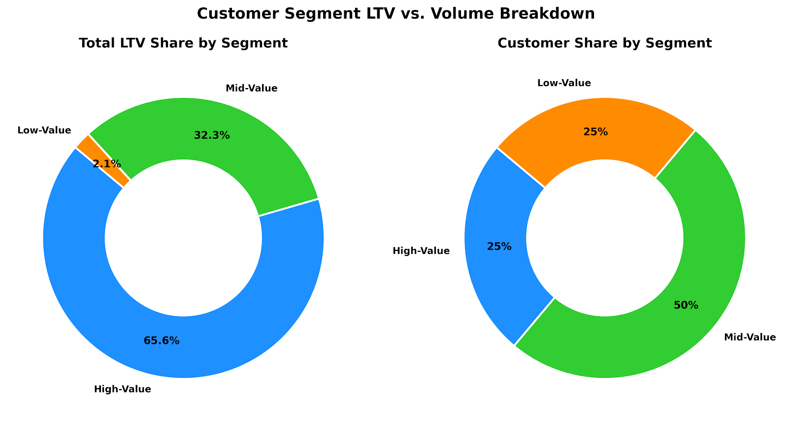
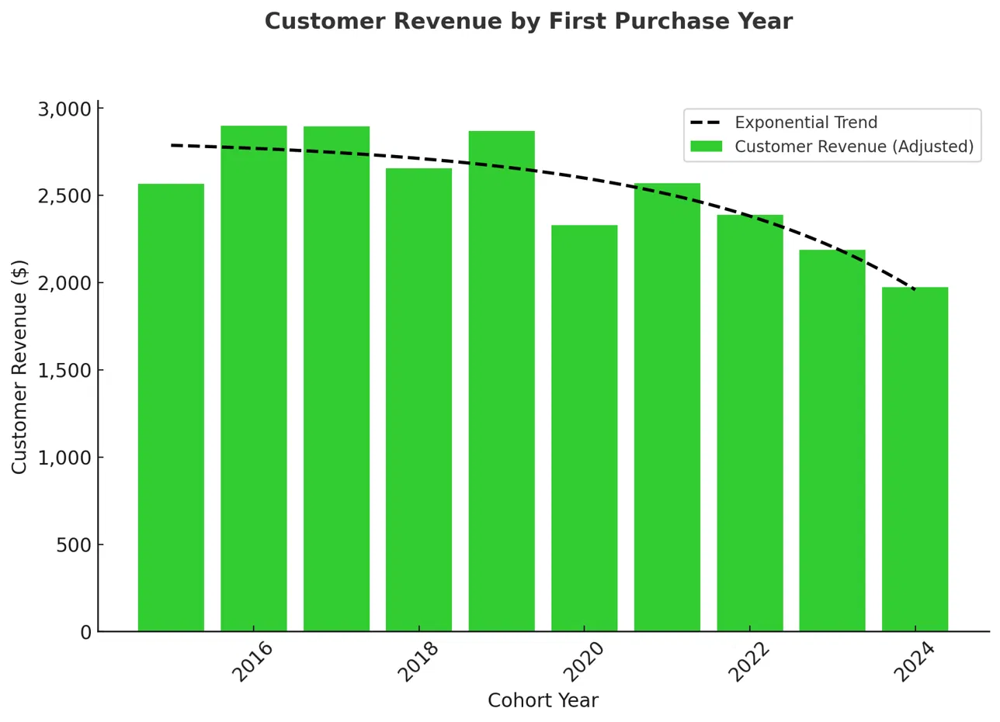
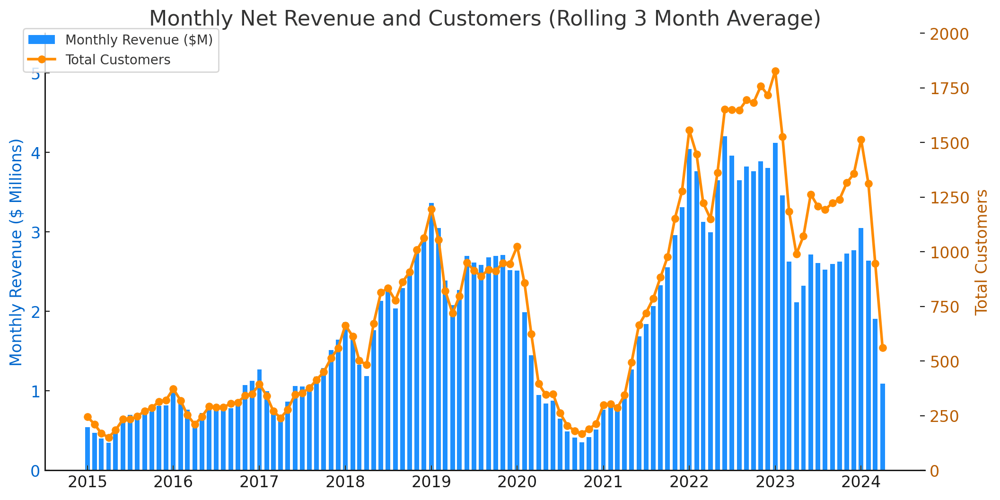
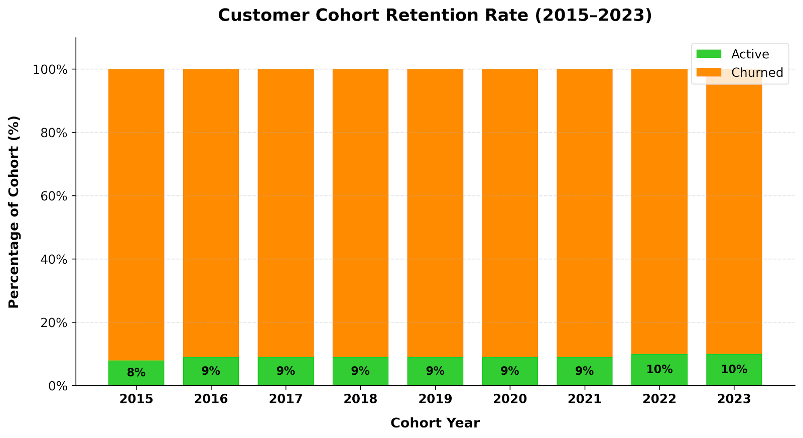

# Intermediate SQL - Sales Analysis

## Overview
This project analyzes e-commerce sales data to understand customer behavior, revenue concentration, and cohort retention. Using SQL for data extraction and data visualization techniques for analysis, the project breaks down customer lifetime value (LTV), cohort spending trends, and long-term customer status to help the business increase sales and keep more customers.

## Business Questions 
1. **Customer Segmentation:** Who are our most valuable customers?
2. **Cohort Analysis:** How do different customer groups generate revenue?
3. **Retention Analysis:** Which customers haven't purchased recently?

## Clean Up Data
🖥️ Query: [0_view.sql](/0_view.sql)

- Aggregated sales and customer data into revenue metrics
- Calculated first purchase dates for cohort analysis
- Created view combining transactions and customer details

## Analysis

### 1. Customer Segmentation

🖥️ Query: [1_customer_segmentation.sql](/1_customer_segmentation.sql)

- Categorized customers based on total lifetime value (LTV)
- Assigned customers to High, Mid, and Low-value segments
- Calculated key metrics: total revenue

**📈 Visualization**

📊 **Key Findings:**
- High-value segment generates 65.6% ($135.43M) of total revenue from 25% of customers, averaging $10,946.43 per user.
- Mid-value segment represents 50% of customers (24,743 users) and contributes 32.3% ($66.64M) of revenue, averaging $2,693.14 per user.
- Low-value segment makes up 25% of customers but accounts for only 2.1% ($4.34M) of total revenue, averaging $350.94 per user.

💡 **Business Insights:**
- Prioritize VIP loyalty programs and dedicated support for high-value users to prevent churn among top spenders.
- Focus on upselling the mid-value segment, as moving even a small portion into high-value will significantly increase revenue.
- Minimize marketing spend on low-value customer acquisition so it does not erode overall profit margins.

### 2. Cohort Analysis

🖥️ Query: [2_cohort_analysis.sql](/2_cohort_analysis.sql)

- Tracked revenue and customer count per cohorts
- Cohorts were grouped by year of first purchase
- Analyzed customer revenue at a cohort level

**📈 Visualization**

Customer Revenue by Cohort - First Purchase Date

Monthly Net Revenue & Customer Trends (3 Month Rolling Average)

📊 **Key Findings:** 
- Customer revenue is declining: the 2016, 2017 and 2019 cohorts spent ~$2,900 per customer, while the 2024 cohort dropped to ~$1,970.
- Revenue and customers peaked in 2022-2023, but both fall at the end of the series in 2024, though the latest months may be incomplete.
- High volatility in revenue and customer count, with a sharp drop in 2020 and another at the end of the series, which may partly reflect incomplete 2024 data.

💡 **Business Insights:**
- Boost retention & re-engagement by targeting recent cohorts (2022-2024) with personalized offers to prevent churn.
- Stabilize revenue fluctuations and introduce loyalty programs or subscriptions to ensure consistent spending.
- Investigate cohort differences by applying successful strategies from high-spending cohorts (2016, 2017 and 2019) to newer ones.

### 3. Customer Retention

🖥️ Query: [3_retention_analysis.sql](/3_retention_analysis.sql)

- Identified customers at risk of churning
- Analyzed last purchase patterns
- Calculated customer-specific metrics

**📈 Visualization**

📊 **Key Findings:**
- Cohort churn stabilizes at ~90% after 2-3 years, indicating a predictable long-term retention pattern.
- Retention rates are consistently low (8-10%) across all cohorts, suggesting retention issues are systemic rather than specific to certain years.
- Newer cohorts (2022-2023) show the same churn levels as older ones, suggesting that without intervention future cohorts will follow the same pattern.

💡 **Business Insights:**
- Strengthen early engagement strategies to target the first 1-2 years with onboarding incentives, loyalty rewards, and personalized offers to improve long-term retention.
- Re-engage high-value churned customers by focusing on targeted win-back campaigns rather than broad retention efforts, as reactivating valuable users may yield higher ROI.
- Predict & preempt churn risk and use customer-specific warning indicators to proactively intervene with at-risk users before they lapse.

## Strategic Recommendations

**Customer Value Optimization (Customer Segmentation)**
- Launch a VIP loyalty tier with dedicated support and perks for the 12,372 high-value customers, who generate 65.6% of revenue.
- Build personalized upgrade paths for mid-value customers. As an illustration, every 1% of them (about 247 customers) who reach the high-value average adds roughly $2.0M.
- Keep engagement with low-value customers cheap and automated, such as email promotions, instead of paying to acquire more of them.

**Cohort Performance Strategy (Cohort Analysis)**
- Compare cohorts at the same age before concluding that spending is declining, since newer cohorts have had less time to spend. If the gap holds, target the 2022-2024 cohorts with personalized re-engagement offers.
- Find out what drove the large customer intakes in 2018, 2019 and 2022 and repeat what worked.
- Introduce loyalty or subscription programs to smooth out swings in revenue such as the 2020 dip.

**Retention & Churn Prevention (Customer Retention)**
- Add onboarding incentives and loyalty rewards in the first 1-2 years of the customer relationship, since about 90% of every cohort has churned.
- Run win-back campaigns for churned high-value customers first, after measuring how much revenue they represent by combining value segments with churn status.
- Use days since last purchase as an early-warning signal and contact at-risk customers before they lapse.

## Technical Details
- **Database:** PostgreSQL
- **Analysis Tools:** PostgreSQL, DBeaver, PGadmin
- **Visualization:** Google Gemini 